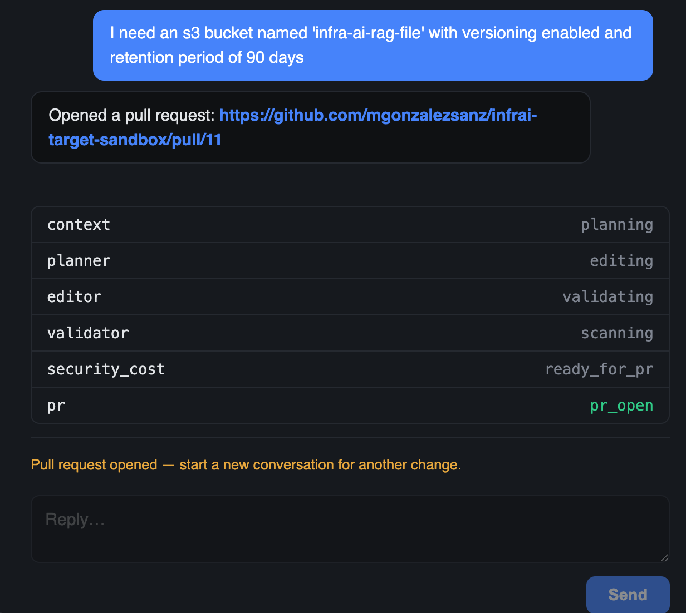
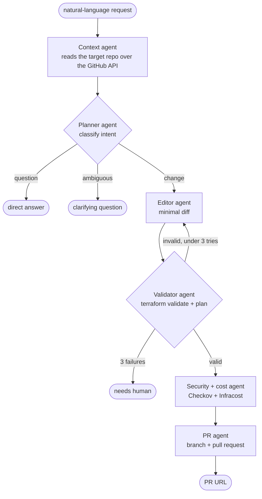
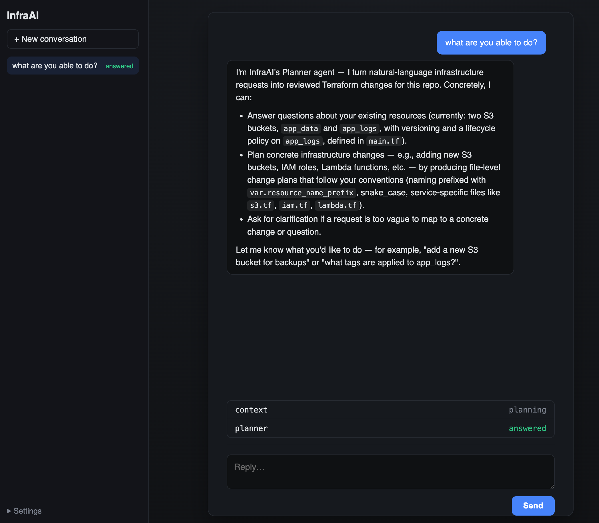
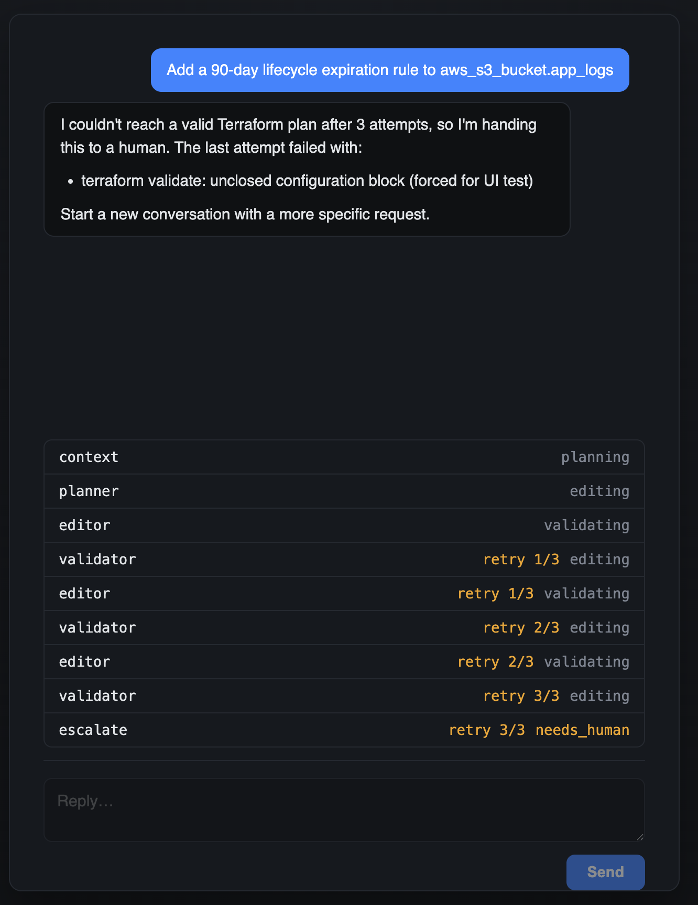
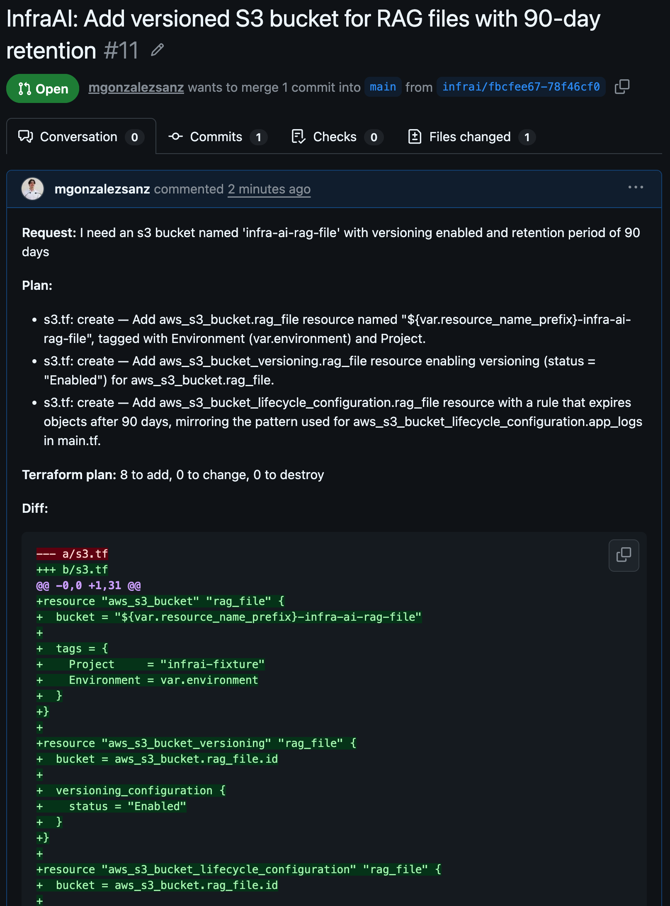

# InfraAi

[](https://github.com/mgonzalezsanz/InfraAi/actions/workflows/test.yml)

Agentic system that turns a natural-language infrastructure request into a
validated, human-reviewed Terraform change — LangGraph multi-agent orchestration
with a PR-gated safety model.

You describe a change in plain English ("add versioning to the app_data bucket").
A team of agents reads your Terraform repo, writes a minimal diff, checks it
against real cloud state with plan-only credentials, scans it for security and
cost issues, and opens a pull request. You approve by merging — `terraform apply`
runs only in the target repo's own CI, with credentials the agent never holds.



> Resource/identifier names use `infrai-` (one *a*) — short for InfraAi. It's the
> established convention across this repo's code, tests, and the live AWS/GitHub
> resources — not a typo, don't "fix" it to `infraai-` in one place only.

## How it works



| Agent | Does | Notes |
|---|---|---|
| **Context** | Summarizes the target repo's resources, variables, naming conventions | Fetches only `.tf` + `infrai.config.yaml` blobs over the GitHub API — no clone |
| **Planner** | Classifies the request as `change` / `question` / `ambiguous`; produces a file-level plan, a direct answer, or a clarifying question | Only `change` continues to the Editor. Reads the full conversation thread, so a follow-up answer to a clarifying question resumes the same run |
| **Editor** | Writes the new file contents for the plan's steps, grouped by AWS service (`s3.tf`, `iam.tf`, …) | Re-invoked with the error attached when the Validator fails |
| **Validator** | `terraform validate`, then `terraform plan` against a sandbox AWS account | Uses `infrai-plan-role` (read-only). Loops back to the Editor on failure, capped at 3 retries, then escalates |
| **Security + cost** | Checkov scan + Infracost delta vs. the repo's budget ceiling | Informational in the PR body — the human decides, it never blocks |
| **PR** | Opens a branch + PR with the diff, plan output, findings, and cost delta | Idempotent: re-running updates the existing PR instead of opening a duplicate. The branch is keyed to the conversation, so every follow-up turn lands on the same PR |

The graph is defined in [`graph.py`](graph.py); shared state in [`state.py`](state.py).

A `question` request never touches Terraform — the Planner answers from the repo
context and the run ends there:



When the Validator can't reach a clean `terraform validate` / `plan`, it loops
back to the Editor — re-invoked with the failure attached to its prompt, so each
retry is a targeted fix. After three tries the graph stops looping and hands off
to a human, carrying the Terraform errors from the last attempt rather than a
bare status:



## Two repos, not one

This repo (`InfraAi`) is the **agentic codebase only** — it never contains the
Terraform being managed. A separate **target repo** holds the Terraform folder,
receives the PR, and on merge runs its own CI:

- `plan.yml` — automatic on merge to `main`, read-only OIDC role, publishes the plan
- `apply.yml` — `workflow_dispatch` only; a human reads the plan then clicks Run,
  applying the exact plan that was reviewed with a separate scoped OIDC role

This repo *ships* those workflows, the IAM policies, and a config template as
files you copy into your target repo (see
[`templates/target-repo-setup/SETUP.md`](templates/target-repo-setup/SETUP.md))
— it never executes them on itself.

## Safety model

- **The agent never applies anything.** Repo writes are always a branch + PR,
  never a push to a protected branch. `terraform apply` only ever runs in the
  target repo's manually-triggered CI job.
- **Read-only everywhere for plan/analysis.** `infrai-plan-role` (this repo's
  runtime) and `infrai-target-plan-role` (the target's `plan.yml`) are
  `Describe*`/`Get*`/`List*` only, with an explicit `Deny` on every mutating verb
  as a backstop. [`tests/test_iam_policies.py`](tests/test_iam_policies.py) fails
  the build if a mutating action ever appears in either policy.
- **Exactly one apply-capable role**, `infrai-apply-role`, reached only via OIDC
  from the target repo's `apply.yml` / `destroy.yml` — both `workflow_dispatch`,
  both pinned to `main` and the `production` Environment. No static keys, never
  present in this repo's runtime.

Full rationale (OIDC `sub` claims, the SHA guard, budget checks) is in
[`templates/target-repo-setup/SETUP.md`](templates/target-repo-setup/SETUP.md).

## Setup

Paths below use the venv layout for macOS/Linux (`.venv/bin/`). On Windows use
`.venv/Scripts/` and `.exe` suffixes.

**1. Python deps** (Python 3.12+):
```
python -m venv .venv
source .venv/bin/activate      # Windows: .venv\Scripts\activate
pip install -r requirements-dev.txt
```
Checkov is pulled in automatically here — no separate install needed.

**2. External CLIs** — Terraform (validator agent) and Infracost (cost estimation):
```
# macOS
brew install hashicorp/tap/terraform   # Terraform is no longer in brew core
brew install infracost

# Windows (restart the terminal afterward — PATH only refreshes for new sessions)
winget install Hashicorp.Terraform
winget install Infracost.Infracost
```
Infracost must be **v2.x or newer** (`run_infracost` calls `infracost scan --json`).
No API key needed.

**3. `.env`** — copy `.env.example` to `.env` and fill in:
- `ANTHROPIC_API_KEY` — required, powers the Planner/Editor agents.
- `INFRAI_TARGET_REPO` — `owner/repo` of the target repo the PR agent opens PRs
  against (e.g. `mgonzalezsanz/infrai-target-sandbox`). Required before running
  the PR agent.
- `LANGSMITH_*` — optional, only needed for trace observability.

**4. AWS** — `terraform validate` and Checkov/Infracost run with zero AWS access;
`terraform plan` needs a **dedicated sandbox AWS account** (a separate AWS
Organizations member account, not your main account) reached through a read-only
identity:
- Create the sandbox account (console → AWS Organizations → Add an account).
- In it, create an IAM user `infrai-plan` with `policies/plan-role.json` as an
  inline permissions policy — read-only, with an explicit Deny on all mutating
  actions as a backstop. (The policy is *named* `infrai-plan-role`; the principal
  is a user, not an assumable role.)
- `aws configure --profile infrai-plan` with that user's access key, region set
  to wherever the sandbox resources live. The Validator agent uses this exact
  profile name by default (override via `run_plan(files, aws_profile=...)`).
- Verify: `aws sts get-caller-identity --profile infrai-plan` resolves to the
  `infrai-plan` user, and `aws s3api create-bucket --bucket x --profile infrai-plan`
  fails with an explicit-deny `AccessDenied`.
- Multi-account tip: if you administer the sandbox from the Organizations
  management account, a `[profile infrai-sandbox]` with
  `role_arn = …:role/OrganizationAccountAccessRole` + `source_profile = <mgmt user>`
  gives you admin there without a second key. `infrai-plan` stays a direct
  read-only key — never point it at an admin role.

**5. GitHub CLI** — the PR agent shells out to `gh` (no separate PAT or GitHub App needed):
```
brew install gh          # macOS;  Windows: winget install GitHub.cli
gh auth login
```
Needs `repo` scope, plus `workflow` if any PR it opens touches `.github/workflows/`
(interactive login grants both). Verify with `gh auth status`.

## Running it

Tests (fast, offline — every external tool call is faked):
```
.venv/bin/pytest -q
```

Web UI (run from the repo root so imports resolve):
```
.venv/bin/python -m uvicorn ui.app:app --reload
```
Open `http://127.0.0.1:8000`, type a request, and watch the run log update live
until it lands on a PR URL, a direct answer, or a clarifying question you can
reply to in the same thread.

To exercise the editor/validator retry loop and the human-escalation exit without
a real broken plan, set `INFRAI_FORCE_VALIDATE_FAIL` before launching — every
`terraform validate` then fails with that message, so any change request loops
three times and escalates:
```
INFRAI_FORCE_VALIDATE_FAIL="terraform validate: unclosed configuration block" \
  .venv/bin/python -m uvicorn ui.app:app --reload
```

Or via LangGraph Studio (makes real Anthropic/Terraform/Checkov/Infracost calls):
```
.venv/bin/langgraph dev --no-browser
```
Then open `https://smith.langchain.com/studio/?baseUrl=http://127.0.0.1:2024` and
invoke the `infrai` graph with e.g.
`{"user_request": "Add versioning to the app_data S3 bucket"}`.

## What the PR agent opens

Every `change` run ends with a pull request against the target repo — the diff
plus a summary of the plan, the `terraform plan` add/change/destroy line, the
Checkov findings, and the Infracost delta.



## Project status

Every agent is a real implementation, not a stub. The full pipeline has been run
end-to-end against a live sandbox account: a request to add a versioned S3 bucket
with a lifecycle rule went request → plan → validate → scan → PR → merge → CI
plan → CI apply, with the bucket verified live in AWS.

- 80+ pytest tests, all offline (LLM and every external CLI faked)
- Every functional requirement has a matching acceptance test
- Not yet built: multi-cloud, multi-repo

## License

MIT — see [LICENSE](LICENSE).
